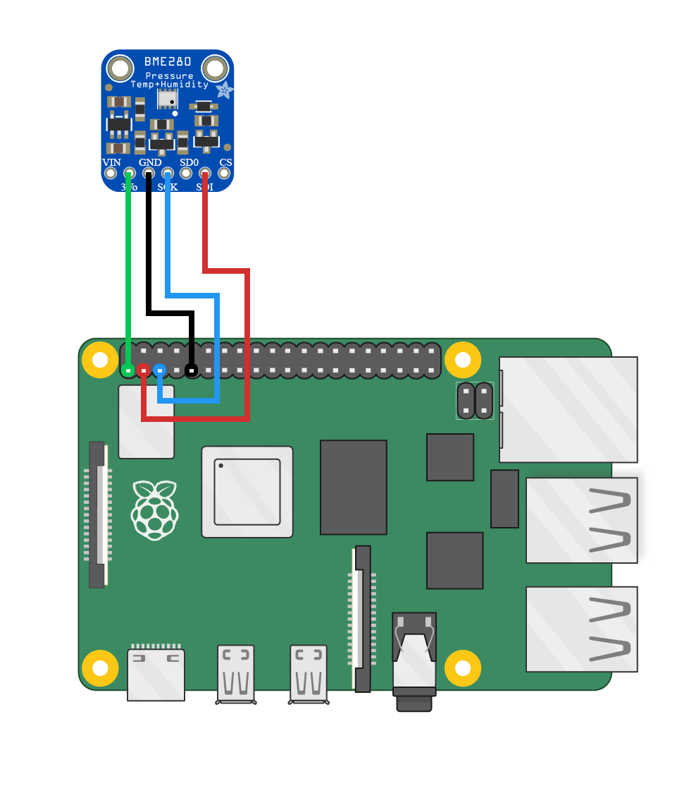

# bme280-websensor

A Python project to read environmental data from a BME280 sensor and publish it on a webserver built with Flask. The published sensor data can then be accessed and utilized by INDIlib for further processing.

## Features

- Reads temperature, humidity, and pressure data from the BME280 sensor using Python.
- Serves sensor data through a RESTful API on a Flask webserver.
- Designed for integration with INDIlib for astronomical instrumentation and control.

## Installation

1. Clone this repository:
   ```bash
   git clone https://github.com/ecalandrini/bme280-websensor.git
   cd bme280-websensor

2. (Optional) Create and activate a virtual environment:
   
```python3 -m venv venv
source venv/bin/activate  # On Windows: venv\Scripts\activate
```

4. Install the required Python packages:

```
pip install -r requirements.txt
```

## Usage

1. Connect your BME280 sensor to the device running this script (e.g., Raspberry Pi).
   

3. Start the Flask Server:
   ```
   python3 server_api.py
   ```

4. Access sensor data:

http://your-device-ip:5000/

4. INDIlib can then read this data via the web API for further use.

## Project Structure
- app.py — Flask application serving sensor data.

- sensor.py — Python script handling communication with BME280 sensor.

- requirements.txt — Python dependencies.

## License

This project is licensed under the MIT License. See the LICENSE file for details.
